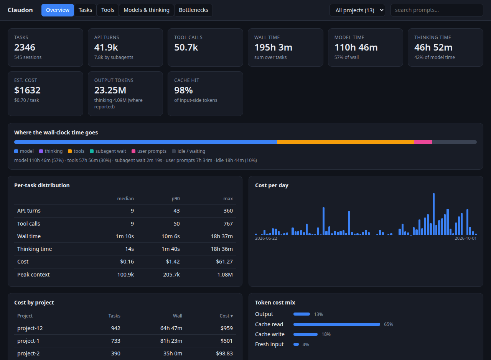

<div align="center">

# Claudon

**See where your Claude Code time and money actually go.**

One command turns your session logs into an interactive HTML dashboard.<br>
100% local · zero dependencies · nothing leaves your machine.

[](https://github.com/infenia/claudon/actions/workflows/ci.yml)
[](https://pypi.org/project/claudon/)
[](https://www.npmjs.com/package/claudon)
[](https://pypi.org/project/claudon/)
[](LICENSE)

```bash
uvx claudon --open
```



<sub>Demo data. Your own sessions stay on your machine.</sub>

</div>

---

## Why Claudon?

Claude Code is fast until it isn't. Which turn burned ten minutes? Was it the model, a slow tool, or you being away? Did that failing tool call loop? What did the session really cost? Your answers are already in `~/.claude`; Claudon reads them and shows you:

- **Where time went**: model vs. tools vs. permission waits vs. idle, per task, turn and subagent.
- **What it cost**: token usage × list prices per model generation (override with `--pricing`).
- **What went wrong**: automatic detection of tool failures, slow turns and retry loops.
- **How hard it thought**: thinking time vs. thinking tokens.
- **Safe to share**: `--redact` strips prompts, paths, commands and project names.

It is a single Python file using only the standard library. No telemetry, no network, no account.

---

## 🚀 Quick Start

Use whichever runner you already have; each downloads and runs the latest release on demand:

| Tool | Run once | Install globally |
|---|---|---|
| **uv** | `uvx claudon` | `uv tool install claudon` |
| **pipx** | `pipx run claudon` | `pipx install claudon` |
| **pip** | | `pip install claudon` |
| **npm** | `npx claudon` | `npm install -g claudon` |
| **pnpm** | `pnpm dlx claudon` | `pnpm add -g claudon` |
| **Yarn** (2+) | `yarn dlx claudon` | |
| **Bun** | `bunx claudon` | `bun add -g claudon` |
| **Shell script** | | [`install.sh`](#standalone-shell-script) |
| **Browser** | [WebAssembly page](#-webassembly-in-browser--zero-python) | no install |

```bash
claudon ~/.claude -o report.html --open      # after a global install
```

> The npm-family packages (npx, pnpm, yarn, bun) are a thin launcher around the same Python script, so they need
> **Python 3.11+** on your `PATH` (`python3`, `python` or `py`). No Python at all? Use the browser version or a
> standalone binary from [GitHub Releases](https://github.com/infenia/claudon/releases).
> Use `@beta` / `uvx --prerelease allow` for pre-releases.

### Standalone Shell Script
```bash
curl -fsSL https://raw.githubusercontent.com/infenia/claudon/main/install.sh | sh

# recommended: pin a release (see GitHub Releases); claudon.py is checked against that release's SHA256SUMS
curl -fsSL https://raw.githubusercontent.com/infenia/claudon/main/install.sh | CLAUDON_VERSION=vX.Y.Z sh
```
The checksum catches corrupted or mismatched downloads. To also prove a release file was built by this repo's
workflow, download it and run `gh attestation verify claudon.py -R infenia/claudon`.

### Direct Clone
```bash
git clone https://github.com/infenia/claudon.git
cd claudon
python3 claudon.py ~/.claude -o report.html --open
```

### ⚡ WebAssembly (In-Browser / Zero Python)
Run Claudon entirely in your browser without local Python installed via GitHub Pages or local HTTP server:
- **Live web app**: [claudon.infenia.com](https://claudon.infenia.com/)
- **Local server**: From the repository root run `python3 -m http.server` and open `http://localhost:8000/wasm/`.

Drop `.jsonl` transcripts, or use **Open Folder** on `~/.claude/projects` to keep project grouping and subagents.

**Nothing is uploaded.** Files are read by the browser and analyzed on your machine; the page's only network requests
download the Pyodide runtime (jsDelivr) and `claudon.py`, and once it shows *Ready* it keeps working offline. Chrome and
Edge ask to let the page *view* the folder. Browsers without that folder API (Firefox, Safari) show their own
"upload" prompt for folder pickers, which only grants the page read access.

### 🛠️ Native Binary (Nuitka)
To compile Claudon into a single native binary locally:
```bash
pip install nuitka==4.2.2 zstandard
python scripts/build_nuitka.py --onefile
```
Standalone executables are output to `dist/`.

### 📦 Releases
Claudon follows **Semantic Versioning** and is released through an automated, reviewable pipeline: Conventional Commit PR titles drive an auto-generated release PR (version bump + [CHANGELOG](CHANGELOG.md)); merging it tags the release and publishes:
- **Nuitka Binaries**: Linux x86_64, macOS (arm64 and Intel) and Windows, attached to GitHub Releases with `SHA256SUMS` and build provenance attestations (`gh attestation verify <file> -R infenia/claudon`).
- **PyPI**: `uvx`, `pipx` or `pip` (trusted publishing).
- **npm**: `npx`, `pnpm dlx`, `yarn dlx` or `bunx` (with provenance).

Want pre-release builds? `uvx --prerelease allow claudon` or `npx claudon@beta`. Full process: [docs/RELEASING.md](docs/RELEASING.md).

---

## ⚡ Integration with Claude Code

Install Claudon as a native slash command inside Claude Code:

```bash
claudon --install-plugin
```

Once installed, simply type `/claudon` in any active Claude Code CLI session to instantly generate and open your analytics dashboard!

---

## ⚙️ Options & CLI Usage

```bash
claudon [PATH] [-o FILE] [--redact] [--pricing FILE] [--open] [--install-plugin [--force]] [--version]
```

`PATH` can be a `~/.claude` directory, its `projects/` subfolder, a specific project directory, or a single `.jsonl` transcript file (default: `$CLAUDE_CONFIG_DIR` if set, else `~/.claude`).

| Flag | Description |
|---|---|
| `-o FILE`, `--out FILE` | Output HTML report file path (default: `cc_report.html`) |
| `--redact` | Redact prompts, titles, project names, paths, commands, session IDs and MCP server names for safe report sharing |
| `--pricing FILE` | Custom $/MTok rates keyed by model-id substring (longest match wins): `{"claude-opus-4-1": [input, output, cache_read, write_5m, write_1h]}` |
| `--open` | Automatically open the generated HTML report in your default browser |
| `--install-plugin` | Register `/claudon` slash command in `<config dir>/commands/` |
| `--force` | With `--install-plugin`: overwrite a `claudon.md` you have edited (otherwise it is left alone) |
| `--version` | Print the version |

---

## 📊 What's in the Report?

- **Task Breakdown**: each human prompt through to completion.
- **Turns & Subagents**: model API calls vs. agent delegation.
- **Time, Thinking & Cost**: the breakdowns described [above](#why-claudon).
- **Bottlenecks**: failures, slow turns and loops, surfaced automatically.

The report is one self-contained `.html` file: no server, no external assets, easy to attach to an issue (use `--redact`).

---

## 🤝 Contributing

Contributions are welcome. Please read [CONTRIBUTING.md](CONTRIBUTING.md) (PR titles must be [Conventional Commits](https://www.conventionalcommits.org/)), follow the [Code of Conduct](CODE_OF_CONDUCT.md), and report vulnerabilities privately per [SECURITY.md](SECURITY.md). See the [CHANGELOG](CHANGELOG.md) for release history.

---

## 📄 License

Developed by **Infenia Private Limited**. MIT License. See [LICENSE](LICENSE) for details.
