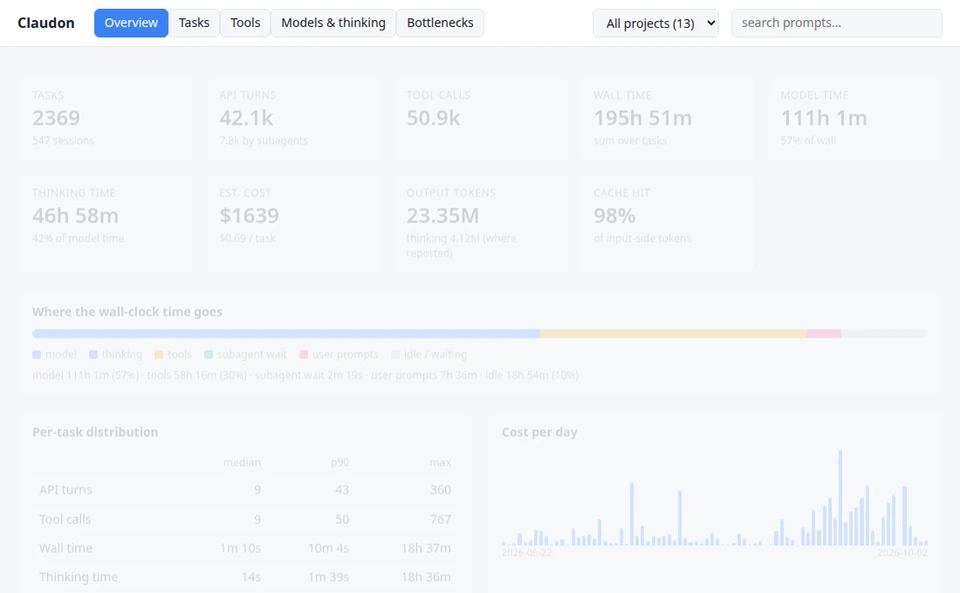

<div align="center">

# Claudon

**See where your Claude Code time and money actually go.**

One command turns your session logs into an interactive HTML dashboard.<br>
100% local · zero dependencies · nothing leaves your machine.

[](https://github.com/infenia/claudon/actions/workflows/ci.yml)
[](https://pypi.org/project/claudon/)
[](https://www.npmjs.com/package/@infenia/claudon)
[](https://pypi.org/project/claudon/)
[](LICENSE)

```bash
uvx claudon --open
```

<picture>
  <source media="(prefers-color-scheme: dark)" srcset="docs/assets/demo-dark.webp">
  
</picture>

<sub>Redacted sample. Your own sessions stay on your machine.</sub>

[Quick start](#quick-start) · [In the browser](#in-the-browser-no-install) · [Usage](#usage) · [Privacy](#privacy) · [Contributing](#contributing)

</div>

---

## Why Claudon?

Claude Code is fast until it isn't. Which turn burned ten minutes? Was it the model, a slow tool, or you being away? Did a failing tool call loop? What did the session really cost?

The answers are already in `~/.claude`. Claudon reads them and shows you:

| | |
|---|---|
| **Where time went** | model vs. tools vs. permission waits vs. idle, per task, turn and subagent |
| **What it cost** | token usage × list prices per model generation (override with `--pricing`) |
| **What went wrong** | ranked findings with a concrete fix each: tool failures and retry loops, permission-prompt waits, expired prompt caches, repeated reads, edit churn, context bloat, trends |
| **How hard it thought** | thinking time vs. thinking tokens |
| **Safe to share** | `--redact` strips prompts, paths, commands and project names |

It is a small Python package using only the standard library. No telemetry, no network, no account.

---

## Quick start

Run it with whichever tool you already have. Each one downloads the latest release on demand.

| Tool | Run once | Install globally |
|---|---|---|
| **uv** | `uvx claudon` | `uv tool install claudon` |
| **pipx** | `pipx run claudon` | `pipx install claudon` |
| **pip** | | `pip install claudon` |
| **npm** | `npx @infenia/claudon` | `npm install -g @infenia/claudon` |
| **pnpm** | `pnpm dlx @infenia/claudon` | `pnpm add -g @infenia/claudon` |
| **Yarn** (2+) | `yarn dlx @infenia/claudon` | |
| **Bun** | `bunx @infenia/claudon` | `bun add -g @infenia/claudon` |

After a global install:

```bash
claudon ~/.claude -o report.html --open
```

> **Requirements:** Python 3.11+ on your `PATH` (`python3`, `python` or `py`). The npm-family packages are a thin
> launcher around the same Python script. No Python? Use the [browser version](#in-the-browser-no-install) or a
> standalone binary from [GitHub Releases](https://github.com/infenia/claudon/releases).

<details>
<summary><b>Other ways to install</b> (shell script, git clone, pre-releases)</summary>

### Shell script

```bash
curl -fsSL https://raw.githubusercontent.com/infenia/claudon/main/install.sh | sh

# recommended: pin a release (see GitHub Releases); the download is checked against that release's SHA256SUMS
curl -fsSL https://raw.githubusercontent.com/infenia/claudon/main/install.sh | CLAUDON_VERSION=vX.Y.Z sh
```

The script installs the native binary for your platform (Linux x86_64, macOS arm64/Intel, Windows x86_64 via Git Bash or
MSYS2), so **Python is not needed**. Other platforms (Linux arm64, Alpine/musl) get `claudon.pyz`, which needs Python 3.11+.

On Windows PowerShell:

```powershell
irm https://raw.githubusercontent.com/infenia/claudon/main/install.ps1 | iex
# pin a release: $env:CLAUDON_VERSION = 'vX.Y.Z' first
```
 The checksum catches corrupted or mismatched downloads. To
also prove a release file was built by this repo's workflow, download it and run
`gh attestation verify <file> -R infenia/claudon`.

### Git clone

```bash
git clone https://github.com/infenia/claudon.git
cd claudon
python3 -m claudon ~/.claude -o report.html --open
```

### Pre-releases

```bash
uvx --prerelease allow claudon
npx @infenia/claudon@beta
```

</details>

---

## In the browser (no install)

Claudon also runs entirely in your browser, with no local Python.

- **Live app:** [claudon.infenia.com/app](https://claudon.infenia.com/app/)
- **Locally:** from the repository root run `python3 -m http.server`, then open `http://localhost:8000/wasm/`.

Drop `.jsonl` transcripts onto the page, or use **Open Folder** on `~/.claude/projects` to keep project grouping and subagents.

---

## Use it inside Claude Code

```bash
claudon --install-plugin
```

Then type `/claudon` in any Claude Code session to generate and open your dashboard.

---

## Usage

```bash
claudon [PATH] [-o FILE] [--redact] [--pricing FILE] [--open] [--install-plugin [--force]] [--version]
```

`PATH` can be a `~/.claude` directory, its `projects/` subfolder, a specific project directory, or a single `.jsonl`
transcript. The default is `$CLAUDE_CONFIG_DIR` if set, else `~/.claude`.

| Flag | Description |
|---|---|
| `-o FILE`, `--out FILE` | Output HTML report path (default: `cc_report.html`) |
| `--redact` | Redact prompts, titles, project names, paths, commands, session IDs and MCP server names, for safe sharing |
| `--pricing FILE` | Custom $/MTok rates keyed by model-id substring (longest match wins): `{"claude-opus-4-1": [input, output, cache_read, write_5m, write_1h]}` |
| `--open` | Open the generated report in your default browser |
| `--install-plugin` | Register the `/claudon` slash command in `<config dir>/commands/` |
| `--force` | With `--install-plugin`: overwrite a `claudon.md` you have edited (otherwise it is left alone) |
| `--version` | Print the version |

**Common recipes**

```bash
claudon --open                                  # analyze everything, open the report
claudon ~/.claude/projects/my-project --open    # one project only
claudon --redact -o share-me.html               # safe to attach to an issue
```

### What's in the report

- **Task breakdown:** each human prompt through to completion.
- **Turns & subagents:** model API calls vs. agent delegation.
- **Time, thinking & cost:** the breakdowns described [above](#why-claudon).
- **Bottlenecks:** findings ranked worst first, each with the time and spend at stake, why it matters and how to fix it.

The report is one self-contained `.html` file: no server, no external assets.

### On-device AI (optional)

If your browser ships a built-in language model, the Bottlenecks tab offers an **AI summary** of the findings: a
headline, where the time and money go, and the fixes worth doing first. With the Prompt API there is also an
**Ask AI** tab: chat about the sessions in view ("why was yesterday slow?", "what did the cache cost me?"). Each
answer is grounded on the report's own numbers, cited tasks open on click, and *Data the model saw* shows exactly what
it was given. The chat is kept in your browser's local storage until you clear it. The model runs inside your
browser on your computer, so it works offline and nothing from the report is sent anywhere. Browsers without the API
never show it.

| Browser | What you get |
|---|---|
| Chrome 148+ (desktop) | Summary and Ask AI via the [Prompt API](https://developer.chrome.com/docs/ai/prompt-api) |
| Chrome 138–147, Edge | Summary via the [Summarizer API](https://developer.chrome.com/docs/ai/summarizer-api); in Edge, enable `edge://flags` → *Prompt API for on-device language model* for Ask AI |
| Others | Any browser that adds the same standard `LanguageModel` / `Summarizer` APIs, automatically |

The first use asks the browser to download its model once (a few GB; Chrome needs about 22 GB of free disk and
either a GPU with more than 4 GB of VRAM or 16 GB of RAM). On machines that don't meet the browser's requirements the
feature stays hidden. The numbers in the findings are always computed exactly; the AI only words and prioritises them.

---

## Privacy

Everything runs on your machine. The CLI makes no network requests, and neither does the report page. The optional
AI summary uses the browser's own on-device model; if the browser still has to fetch that model, it does so itself,
and only after you click *Enable on-device AI*.

The browser version uploads nothing either: files are read and analyzed locally. Its only downloads are the Pyodide
runtime (from jsDelivr) and `claudon.pyz`, and once it shows *Ready* it keeps working offline. Chrome and Edge ask to
let the page *view* the folder you pick. Firefox and Safari show their own "upload" prompt for folder pickers, which
only grants the page read access.

---

## Releases

Claudon follows [Semantic Versioning](https://semver.org/). Conventional Commit PR titles drive an auto-generated
release PR (version bump + [CHANGELOG](CHANGELOG.md)); merging it tags the release and publishes:

- **PyPI** (trusted publishing) and **npm** (with provenance)
- **Standalone binaries** for Linux x86_64, macOS (arm64 and Intel) and Windows, on GitHub Releases with `SHA256SUMS`
  and build provenance attestations (`gh attestation verify <file> -R infenia/claudon`), plus `claudon.pyz`
  (single-file Python bundle, used by `install.sh` where no binary exists)

Full process: [docs/RELEASING.md](docs/RELEASING.md).

---

## Contributing

Contributions are welcome. Please read [CONTRIBUTING.md](CONTRIBUTING.md) (PR titles must be
[Conventional Commits](https://www.conventionalcommits.org/)) and follow the [Code of Conduct](CODE_OF_CONDUCT.md).
Report vulnerabilities privately per [SECURITY.md](SECURITY.md).

## License

Developed by **Infenia Private Limited**. MIT License. See [LICENSE](LICENSE).
